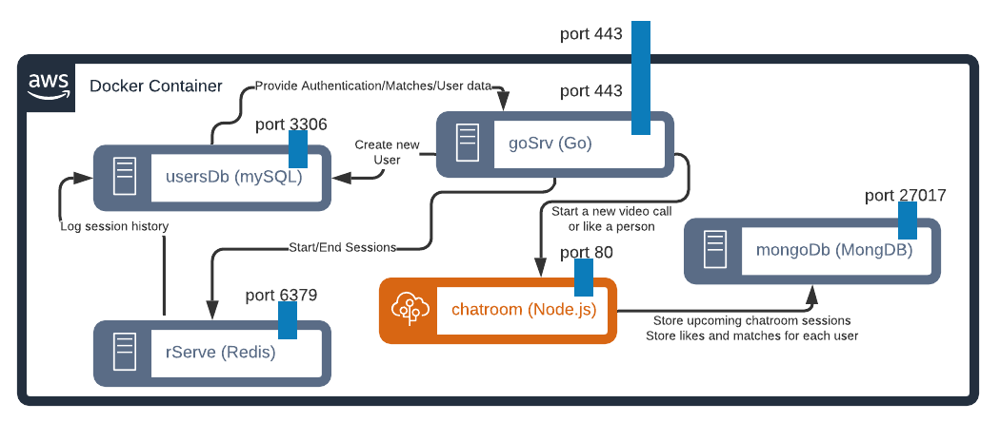

Link to Google Doc For Readability: https://docs.google.com/document/d/1rjxnJF9NU1zrY1mGaobd65GU0ZK09ixvHteGNNcUoPQ/edit?usp=sharing

Project Description
-------------------

As a busy UW student, it can be hard to find time to really spend time looking for love. Each quarter, students spend hours studying for midterms and finals. Not only that, they also have to make time for various group projects and work on dense and difficult homework assignments throughout the quarter. In addition, there might be other priorities and extracurriculars that make it harder to focus on finding the one. However, that is about to change thanks to "Dating on the Ave", an exciting and revolutionary way to make connections with your peers at UW while ensuring you still have time for your other commitments.

How does this work? Well, Dating on the Ave is an online web application that will enable users to sign-up and sign-in to an account where they can establish their own basic user profiles. Profile information might include their name, age, gender, sexuality preference, a profile picture, as well as a short bio about themselves.

After the profile is created you are now ready to start using Dating on the Ave. Each day you will be given 3 people's profile cards based on your preferences. You will have the opportunity to quickly read their information, and if you're interested, you can like them. If they like you back, you will both have access to a chatroom which enables a short 7 minute video chat when both parties have joined. Afterwards, the call ends, the chatroom and user match will be deleted, but if the users like each other they can exchange contact info over the call.

Ideally, this platform will be a means of connecting UW students with one another, and with the video chat functionality, prevent people from threats like getting catfished. You must have a UW email in order to prevent outsiders from also using this application. We want to encourage people who find a connection through these video chats to also continue the conversation, which is why we ask them to share their contact info with each other if they think it's worthwhile. Hopefully, we can help build relationships while fostering a safe environment.

Endpoints
---------------------

  -   /v1/users

      -   POST
-   Headers: 
          -   Content-Type: application/json
-   Body:
            -   "firstName" string < 128 characters
        -   REQUIRED
            -   "lastName" string < 128 characters
                -   REQUIRED
    -   "email" string < 320 characters, contains "@uw.edu"
                -   REQUIRED
        -   UNIQUE
                -   Contains "@uw.edu"
            -   "password" string < 60 characters
                -   REQUIRED
            -   "bio" string < 300 characters
            -   "gender" int
                -   REQUIRED
            -   "sexuality" int
                -   REQUIRED
            -   "photoURL" string < 320 characters
                -   REQUIRED
        -   Status Codes:
          -   201 - New user is created on the platform
              -   Returns Content Type: applicaiton/json user object
          -   400 - Error validating new user to a user or inserting user into database
          -   401 - Unauthorized user
          -   415 - Content Type if header does not start with application/json
          -   500 - Internal Server Error getting users
-   /v1/users/{id}
    -   GET
        -   Headers:
            -   Authorization: {Stringified json user object}
        -   Status Codes:
            -   200 - Get the specified user's info from the id
                -   Returns Content Type: application/json user object
            -   401 - Unauthorized user
            -   404 - User not found
            -   405 - Wrong Request Type
    -   PATCH
        -   Headers:
            -   Authorization: {Stringified json user object}
            -   Content-Type: application/json
        -   Body:
            -   "bio": string < 320 characters
            -   "gender": int
            -   "sexuality": int
            -   "photoURL": string < 320 characters
        -   Status Codes:
            -   200 - User Information updated
                -   Returns Content-Type: application/json updates object of all the changes made by the user.
            -   401 - Unauthorized user
            -   405 - Wrong Request Type
            -   415 - Request body is not JSON
-   /v1/sessions
    -   POST
        -   Headers: 
            -   Content-Type: application/json
        -   Body: 
            -   "email" string < 320 characters
            -   "password" string < 60 characters
        -   Status Codes:
            -   201 - New session started for the user
                -   Returns Content-Type:  application/json user object
            -   401 - Invalid Credentials when signing in (Either email or password)
            -   405 - Wrong Request Type
            -   415 - Request body is not JSON
-   /v1/sessions/mine
    -   DELETE
        -   Headers: 
        -   Body: None
        -   Status Codes:
            -   200 - End session successful
            -   403 - Issue deleting the current ID or No valid session id found or logging out a non currently authenticated user
            -   405 - Not a DELETE request

-   /v1/likes

    -   GET

        -   Headers:

            -   x-user: user object
        -   Status Codes:

            -   200 - Get an array of user id's in the current user's likes

                -   returns object of array of user ids
            -   400 - User has no likes
            -   401 - User is not logged in
            -   500 - Internal server error getting likes
    -   POST

        -   Headers:

            -   x-user: user object
            -   accept: application/json, text/plain ,\*/\*
            -   Content-Type: application/json
        -   Body: 

            -   "userId": int
            -   "matchId": int
        -   Status Codes:

            -   201 - Successfully liked someone! Match id added to your likes
            -   202 - You liked someone who liked you! 
            -   401 - User is not logged in
            -   400 - POST Request must have a user and a match, the matchid already exists in your likes
            -   403 - User does not have permission to like the match
            -   500 - internal server error posting new likes
    -   DELETE

        -   Headers:

            -   x-user: user object
            -   accept: application/json, text/plain ,\*/\*
            -   Content-Type: application/json
        -   Body:

            -   "userId": int
            -   "matchId": int
        -   Status Codes

            -   200 - Successfully removed user from likes
            -   400 - Request must have a user id and match id, no likes to delete, user does not have the matchid in their likes
            -   500 - Internal server error deleting likes
-   /v1/matches

    -   GET

        -   Headers:

            -   x-user: user object
        -   Status Codes:

            -   200 - Get an array of user id's in the current user's matches

                -   returns object of array of user id's
            -   400 - User has no matches
            -   401 - User is not logged in
            -   500 - Internal server error getting matches
    -   POST

        -   Headers:

            -   x-user: user object
            -   accept: application/json, text/plain ,\*/\*
            -   Content-Type: application/json
        -   Body: 

            -   "userId": int
            -   "matchId": int
        -   Status Codes:

            -   201 - Match id added to your matches
            -   400 - POST Request must have a user and a match, the matchid already exists in your matches, user already has 3 matches
            -   500 - Internal server error adding match
    -   DELETE

        -   Headers:

            -   x-user: user object
            -   accept: application/json, text/plain ,\*/\*
            -   Content-Type: application/json
        -   Body: 

            -   "userId": int
            -   "matchId": int
        -   Status Codes:

            -   200 - Successfully removed match
            -   400 - user has no matches to delete, user does not have that specific match to delete,
            -   500 - Internal Server Error deleting match
-   /v1/upcoming

    -   GET

        -   Headers:

            -   x-user: user object
        -   Status Codes:

            -   200 - Successfully retrieved upcoming chat calls and rooms

                -   returns json object of objects that contain the match id, and a room id
            -   401 - User must be logged in to see upcoming calls
            -   500 - Internal server error getting upcoming rooms
-   /v1/rooms

    -   GET: (Not supposed to be used by a user)

        -   Headers:

            -   x-user: user object
        -   Status Codes:

            -   200 - Successfully retrieved all chatrooms

                -   returns json object holding all the chat rooms from the database
            -   500 - Internal server error getting room
    -   POST

        -   Headers:

            -   x-user: user object
            -   accept: application/json, text/plain ,\*/\*
            -   Content-Type: application/json
        -   Body:

            -   "user1": int
            -   "user2": int
        -   Status Codes:

            -   201 - New room created!

                -   Returns json object of a new room
            -   401 - User must be logged in
            -   400 - Room must have two users, only a user from the new room can create the new room, room already exists
            -   500 - Internal server error posting room
-   /v1/rooms/{roomId}

    -   DELETE

        -   Headers: none
        -   Status Codes:

            -   200 - Successfully deleted the room 
            -   400 - Room with that id does not exist, or no room id provided
            -   500 - Internal server error deleting the room

User Cases and Priority:
------------------------

| Priority | User         | Description                                                                                                                                     |   |   |
|----------|--------------|-------------------------------------------------------------------------------------------------------------------------------------------------|---|---|
| P0       | Unregistered | I want to be able to create my own profile and re-login into it.                                                                                |   |   |
| P0       | Registered   | I want to be able to make edits to my own profile, or be able to delete my profile if I no longer want to use the application.                  |   |   |
| P0       | Registered   | I want to be able to view my matches’ profiles while logged into an active session as a user.                                                   |   |   |
| P1       | Registered   | I want to be able to connect with matches I am interested in through video chat, as well as be able to send and retrieve messages in real time. |   |   |
| P1       | Registered   | I want to be able to send my contact info through the messaging feature, and be able to re-access it later by only the appropriate users.       |   |   |
| P2       | Registered   | Notification System would also be part of a messaging microservice                                                                              |   |   |

Architecture Diagram
--------------------

Database Schema (MYSQL, but may do messages in MongoDB as microservice json schema)
-----------------------------------------------------------------------------------

-   Users

-   ID int primary key auto_increment not null,

-   FName varchar(50) not null,

-   LName varchar(50) not null,

-   Major varchar(100) not null,

-   Bio varchar(500),

-   Pronouns varchar(50),

-   Sexuality varchar(50),

-   Availability varchar(100) not null,

-   Contact Info varchar(200) not null,

-   Chat room

-   ID int primary key auto_increment not null,

-   Time date not null

-   User_ChatRoom

-   ChatRoomID int not null,

-   User1ID int not null,

-   User2ID int not null,

-   Foreign key (ChatRoomID) references Chatroom(ID),

-   Foreign key (User1ID) references Users(ID),

-   Foreign key (User2ID) references Users(ID)

-   Messages

-   ID int primary key auto_increment not null,

-   SentAt date not null,

-   ExpiresAt date not null,

-   ProposedTime date not null

-   SenderID int not null,

-   ReceiverID int not null,

-   Foreign key (SenderID) references Users(ID),

-   Foreign key (ReceiverID) references Users(ID)

Project Components
------------------

-   Timeline: 1 month
-   Client
-   Video chat page
-   Video for 7 minutes
-   Open chat window at 5 minutes (with alert)
-   At the end of the 7 minutes, they get to pick yes or no, if both pick yes then they can continue the video chat (until they hang up? lol)
-   If no, then unmatched
-   The end
-   If yes, the chat window remains open for another 5 minutes if they want to continue chatting
-   Go back to auth main page
-   Auth Main page
-   3 matches
-   Can click into their profiles, like or dislike
-   Current Liked Matches pending for response 
-   Current Being Liked Matches, pending for response (for you to set up a video scheduling time, or reject) 
-   Current mutually liked matches (not called yet), shows button to start video call (when the time comes, if not, grayed out)
-   Profile (self, or current matches)
-   All the things we entered
-   Current schedule (or class schedule)
-   If it's a match, show video scheduling option
-   Landing page
-   Explain the product
-   Links to signup / login
-   Login page / signup page
-   Server
-   User Database
-   Video ChatRoom database
-   Sessions Tracking
-   Define Endpoints

Group Members: Kelden Lin, Trey Michaels

## Project Pitch

- Audience

  -   UW students seeking love

- Problem

  -   Finding love is hard, especially when you love staying in or are forced to stay in. Online dating apps are full of catfishes, stalkers, and people with bad intentions. Many times what we see online isn't reflective of what the other person is truly like.

- Solution

  -   Our platform will ensure that people are who they say they are by validating their accounts with an UW email, and also connect people with others via video chatting who would likely be relatively nearby because they would all attend the same school.

- THE PROFILE

  -   Name, Age, Year, Bio (300 characters max), Profile Picture, Gender, Sexuality

- THE CALLS

  - 7 minutes video chat (can be ended at any point)

  - At the end of the 7 minutes, call ends

    
